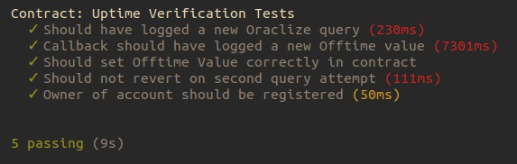

This repo is to demonstrate how an Oraclize smart-contract is used in managing an ISP and its customers account by debiting the ISP account anytime there is a breach in contract in the offtime value gotten from the API using Truffle & the Ethereum-Bridge to do most of the heavy lifting for you. Head on over to the `./test` folder to examine the javascript files that thoroughly test the smart-contract, which latter you will find in `./contracts`.

## :page_with_curl:  _Instructions_

**1)** Fire up your favourite console & clone this repo somewhere:

__`❍ git clone https://github.com/vahiwe/uptime-verification.git`__

**2)** Enter this directory & install dependencies:

__`❍ cd uptime-verification && npm install`__

**3)** Install npx if not already installed:

__`❍ sudo npm install -g npx `__

**4)** Launch Truffle:

__`❍ npx truffle develop`__

**5)** Open a _new_ console in the same directory & spool up the ethereum-bridge:

__`❍ npx ethereum-bridge -a 9 -H 127.0.0.1 -p 9545 --dev `__

**6)** Once the bridge is ready & listening, go back to the first console with Truffle running & compile the contract code

__`❍ truffle(develop)> compile`__

**7)** Migrate the contract to the network:

__`❍ truffle(develop)> migrate `__

**8)** Set the tests going!

__`❍ truffle(develop)> test`__

**9)** Open a _new_ console in the same directory & Start up the ÐApp:

__`❍ npm run dev `__

&nbsp;

## :camera: Passing Tests:

&nbsp;

__*Happy developing!*__
